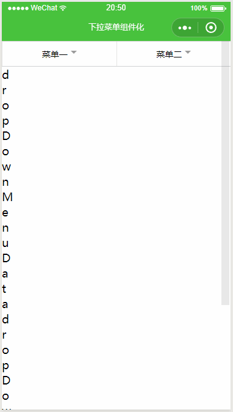

# wxDropDownMenu

一个简单的多列筛选菜单微信小程序组件

## 说明

一直想找一个成熟的可以直接用的多列筛选菜单的组件，都不太符合自己的想法。  
干脆基于一个demo自己封装成一个组件，满足自己的需求。  
css不太会写，经供参考。

## 效果

## 感谢

**Inspired by **
+ [LICEcap](https://www.cockos.com/licecap/)
+ [demo-wx](https://gitee.com/dotton/demo-wx/tree/master/%E4%B8%8B%E6%8B%89%E8%8F%9C%E5%8D%95)